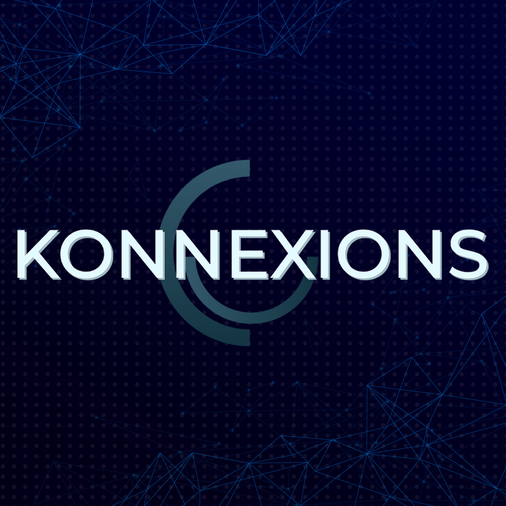
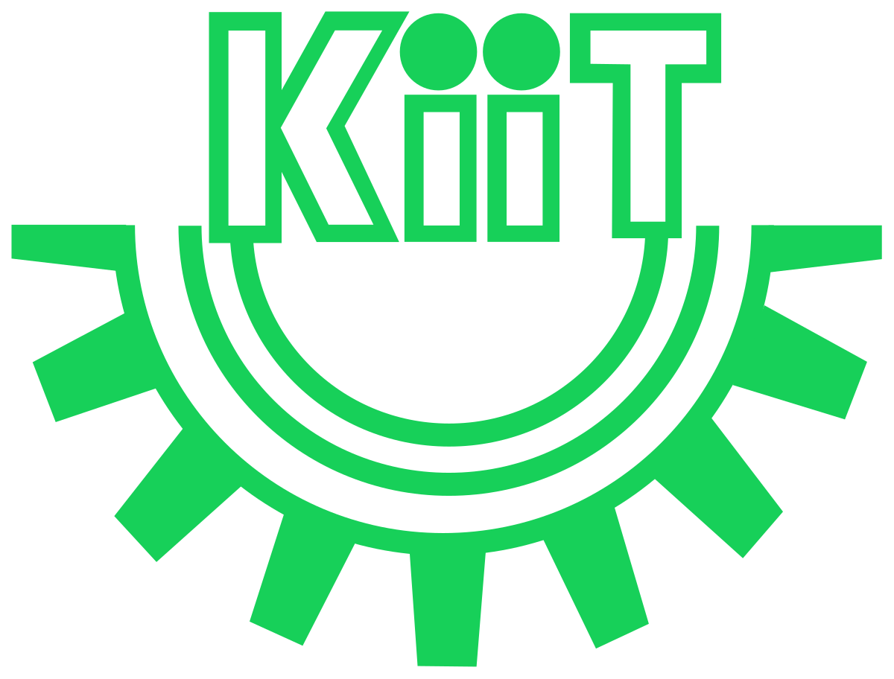

<h3 align="center">Official Github Repo of</h3>
<h1 align="center">KIIT KONNEXIONS</h1>
<h3 align="center">IT & web Development Society</h3>

  
  
  

  <strong>Official Website of KIIT Konnexions</strong>  
  <a href="https://konnexions.netlify.app">View Demo</a>
   
   
  The repository contains the source code of the official website of KIIT Konnexions, the IT & web development society of KIIT Deemed to be University, Bhubaneswar. The website is built with minimal tech stack and is deployed on Netlify. The website is aimed to be a one-stop destination for all the information regarding the society and its activities with its modern and minimal design.

 

<h4 align="center">Built with</h4>

  <a href="https://nextjs.org/"> NextJS </a> - Frontend Framework  
  <a href="https://tailwindcss.com/"> TailwindCSS </a> - Utility-first CSS framework  
  <a href="https://hyvor.com/hygraph"> Hygraph </a> - For Content Management  
  <a href="https://www.netlify.com/"> Netlify </a> - For Deployment  
  <a href="https://www.figma.com/"> Figma </a> - For Designing  
  <a href="https://fontawesome.com/"> FontAwesome </a> - For Icons  

 

<h4 align="center">For Developers</h4>

  <strong>Clone the repository</strong>:
  <code>git clone https://github.com/54nd339/konnexions.git</code>  
  <strong>Install Dependencies</strong>:
  <code>npm install</code>  
  <strong>For Development</strong>: 
  <code>npm run dev</code>  
  <strong>For Production Build</strong>:
  <code>npm run build</code>  
  <strong>For Production Preview</strong>:
  <code>npm run start</code>  

 

<h4 align="center">ToDos</h4>

  <ul>
    <li> Filters in Resources Tab </li>
    <li> Our Work Tab (Having our Projects/Events and Achievements) </li>
    <li> Testimonials, Gallary in Contact Page </li>
    <li> Blog section in Resources Tab </li>
    <li> Events Snippet Page </li>
    <li> Login/Signup Page </li>
    <li> Dashboard for members </li>
  </ul>

 
